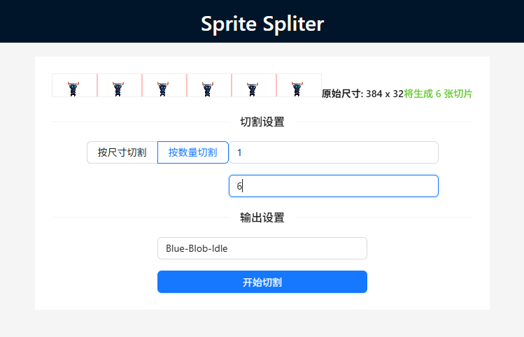

# Sprite Spliter

一个高效、易用的纯客户端 Web 应用程序，帮助游戏开发者和美术设计师快速地将精灵图集（Sprite Sheet）切割成独立的序列帧图片。此工具确保用户数据的绝对隐私（文件不上传至服务器）和零延迟的实时操作体验。



## 功能特性

*   **图片上传与预览**: 支持通过点击选择和拖拽释放两种方式上传本地图片，并清晰展示其原始尺寸。
*   **切割模式选择**: 提供“按尺寸”和“按数量”两种互斥的切割模式。
*   **实时预览与参数校验**: 当用户输入参数时，实时绘制半透明的辅助线网格，直观展示切片布局，并进行输入校验。
*   **输出配置**: 用户可以自定义导出图片的文件名前缀，并自动填充默认值。
*   **切割与导出**: 在客户端内存中完成所有图像处理，并将切割后的图片打包成 `.zip` 压缩文件自动下载。

## 快速启动

### 环境要求

请确保您的系统已安装以下软件：

*   [Node.js](https://nodejs.org/) (推荐 LTS 版本)
*   [npm](https://www.npmjs.com/) (通常随 Node.js 一同安装)

### 运行项目

为了方便您快速启动项目，我们提供了跨平台的启动脚本。

1.  **克隆仓库** (如果您尚未克隆):
    ```bash
    git clone [您的仓库地址]
    cd spritespliter
    ```
    *(注: `[您的仓库地址]` 替换为实际的仓库地址)*

2.  **启动脚本**:

    *   **Windows 用户**:
        双击运行项目根目录下的 `start.bat` 文件。

    *   **macOS / Linux 用户**:
        打开终端，进入项目根目录，然后运行以下命令：
        ```bash
        bash start.sh
        ```

    脚本会自动检查并安装项目依赖（如果尚未安装），然后启动开发服务器。

3.  **访问应用**:
    项目启动成功后，请在您的浏览器中访问：
    ```
    http://localhost:5173
    ```

## 使用说明

1.  **上传图片**: 点击页面中央的拖拽区域，或直接将图片文件拖拽到该区域。
2.  **选择切割模式**: 根据您的需求，选择“按尺寸切割”或“按数量切割”。
3.  **输入参数**: 根据所选模式，输入单帧的宽度和高度，或总行数和列数。页面会实时显示切割网格预览。
4.  **配置输出**: 在文件名前缀输入框中，您可以自定义导出文件的名称前缀。
5.  **开始切割**: 点击“开始切割”按钮，应用将在客户端完成处理，并自动下载包含所有切片的 ZIP 压缩包。
