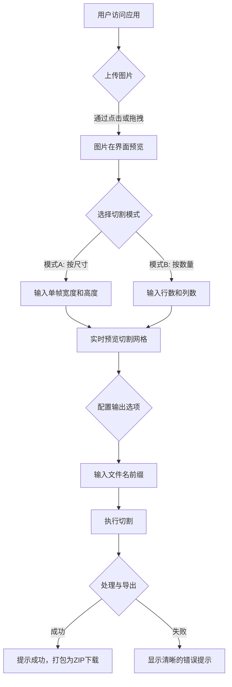

### **项目：图片分割器 (Sprite Spliter) - 详细方案**

#### **1. 项目目标与范围 (Project Goal & Scope)**

核心目标是创建一个高效、易用的**纯客户端 Web 应用程序**，帮助游戏开发者和美术设计师快速地将精灵图集（Sprite Sheet）切割成独立的序列帧图片。此方案将确保用户数据的绝对隐私（文件不上传至服务器）和零延迟的实时操作体验。

#### **2. 详细需求规格 (Detailed Requirements Specification)**

##### **用户流程图 (User Flow Diagram)**

##### **功能性需求 (Functional Requirements)**

*   **FR-1: 图片上传与预览**
    *   支持通过“点击选择”和“拖拽释放”两种方式上传本地图片。
    *   必须支持 `PNG` (含透明通道), `JPG/JPEG`, `BMP`, `WEBP` 格式。
    *   上传后，图片应在主预览区清晰展示，并显示其原始尺寸（宽 x 高）。

*   **FR-2: 切割模式选择**
    *   提供两种互斥的切割模式选项：
        *   **模式A：按尺寸 (By Frame Size)**：用户输入单张切片的宽度和高度（单位：像素）。
        *   **模式B：按数量 (By Grid Count)**：用户输入总共需要切割的行数（Rows）和列数（Columns）。

*   **FR-3: 实时预览与参数校验**
    *   当用户在输入框中输入参数时，预览图上应**实时绘制**半透明的辅助线网格，直观展示切片布局。
    *   系统需自动计算并显示总共将生成多少张切片。
    *   **输入校验**：如果输入的尺寸或数量无法被原图尺寸整除，对应的输入框将高亮显示，并给出明确的文字提示（如：“宽度无法整除！”），同时禁用“开始切割”按钮。

*   **FR-4: 输出配置**
    *   用户可以自定义导出图片的文件名前缀。此输入框的默认值应自动填充为用户上传的文件名（不含扩展名）。
    *   命名规范：导出的图片严格按照 `[前缀]_[序号]` 的格式命名，序号从 `0` 开始，并根据总数量自动补零（例如，总数小于100则补为两位 `_00`, `_01`；大于等于100则补为三位 `_000`, `_001`）。

*   **FR-5: 切割与导出**
    *   点击“开始切割”按钮后，应用在客户端内存中完成所有图像处理。
    *   为保证跨浏览器兼容性和良好的用户体验，所有切割后的图片将被打包成一个 `.zip` 压缩文件，并自动触发下载。压缩包的文件名默认为用户输入的前缀。

##### **非功能性需求 (Non-Functional Requirements)**

*   **NFR-1 (性能)**: 图像处理过程必须高效。对于一张 4096x4096 像素的图集，切割过程应在 5 秒内完成。UI在处理期间不应冻结。
*   **NFR-2 (易用性)**: 采用单页应用（SPA）布局，所有操作在同一视图内完成，避免页面刷新和跳转，实现流畅的用户体验。
*   **NFR-3 (兼容性)**: 应用必须在最新版本的 Chrome, Firefox, Safari, 和 Edge 浏览器上表现一致。
*   **NFR-4 (UI/UX)**: 界面设计应现代化、简洁、直观。所有交互元素（按钮、输入框）都应有明确的悬停（hover）和激活（active）状态。

---

#### **3. 技术选型与架构 (Technology Selection & Architecture)**

*   **核心框架 (Core Framework): React.js + Vite**
    *   **理由**: React 的组件化模型非常适合构建功能独立的 UI 模块（如上传区、预览区、配置区）。Vite 提供闪电般的启动和热更新速度，极大地提升开发效率。

*   **UI 组件库 (UI Library): Ant Design**
    *   **理由**: 提供了一整套高质量、开箱即用的 UI 组件，能让我们快速构建出专业且美观的界面，完美契合“UI易于使用、现代化”的需求。

*   **核心图像处理 (Core Image Processing): HTML5 Canvas API**
    *   **理由**: 这是现代浏览器的原生标准，无需任何外部库即可实现图像的加载、绘制和像素级操作。我们将利用 `drawImage()` 方法的裁剪功能来精确提取每个图块，性能卓越。

*   **文件打包与下载 (File Packing & Download): JSZip**
    *   **理由**: 这是一个轻量级且可靠的库，可以在纯 JavaScript 环境中创建 `.zip` 文件。这解决了在不支持“文件系统访问API”的浏览器中批量保存文件的难题，提供了一致的用户体验。

---

您对这份详细的计划满意吗？如果确认无误，我们可以将此方案保存为项目文档，并准备进入开发阶段。